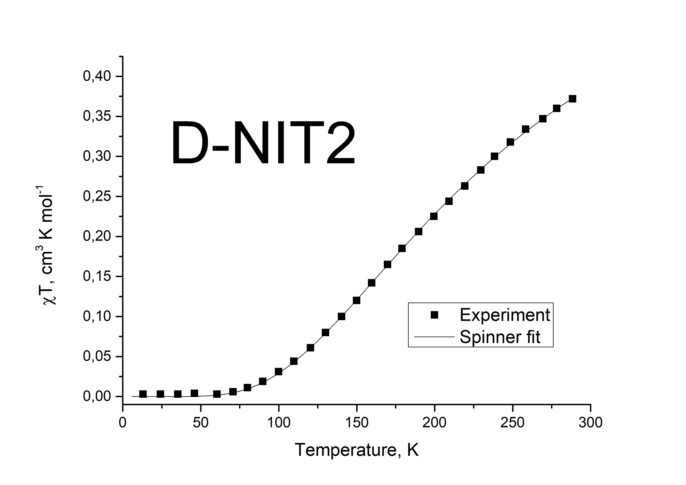
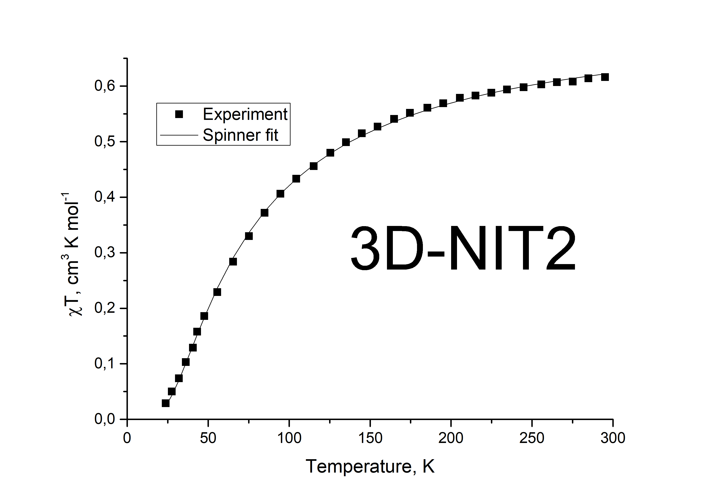
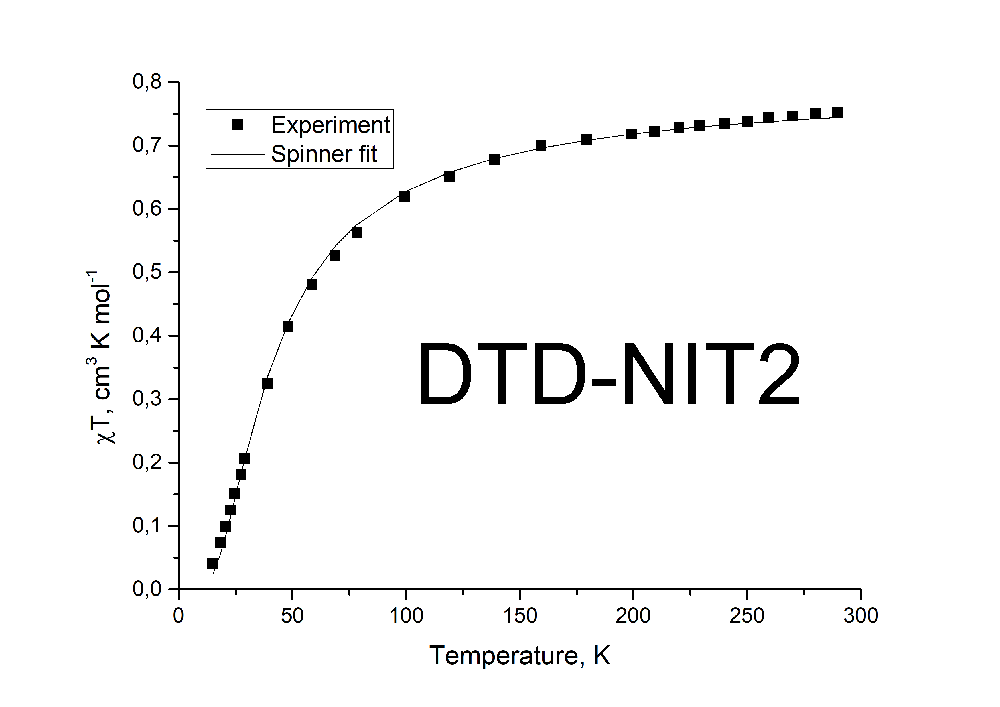
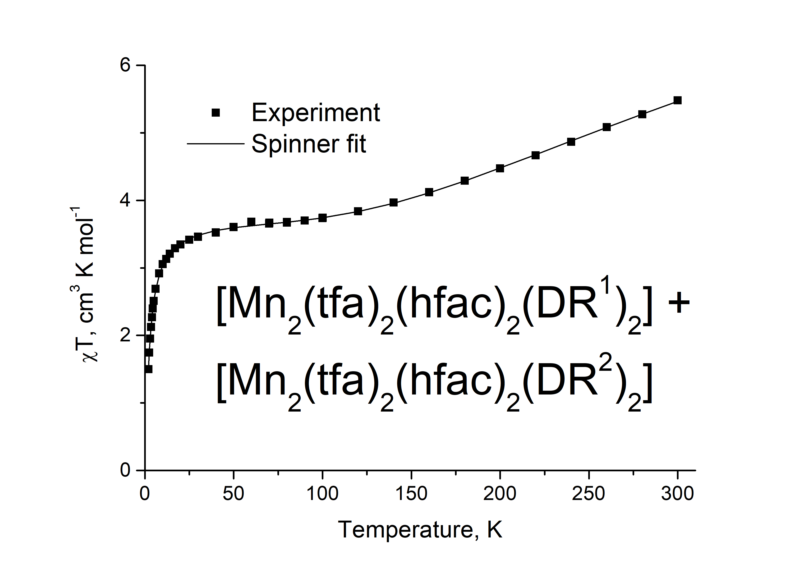
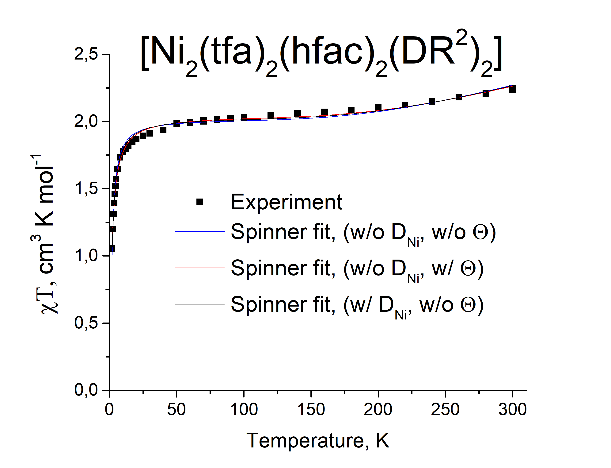

# Organic diradical D-NIT2

Reproducing temperature dependence of magnetic susceptibility
from [Ziessel R. et al.](https://doi.org/10.1021/ja0305959)
using Spinner.

Spinner results: $J = -230 K$, $g = 1.984$.
Fit of $\chi T(T)$ from the article: $J = -230 K$.
ESR data: $g = 2.007$, $J = -240 K$.

# Organic diradicals 3D-NIT2 and DTD-NIT2

Reproducing temperature dependence of magnetic susceptibility from [Stroh C. et al.](https://doi.org/10.1039/B414284E)
using Spinner.

Spinner results: $J = -48.3 K$, $g = 1.986$, $\Theta = -24.7$
Fit of $\chi T(T)$ from the article: $J = -47,5 K$, $\Theta = -25 K$.
ESR data: $g = 2.0065$, $J = -43 K$.

Spinner results: $J = -36.6 K$, $g = 2.062$.
Fit of $\chi T(T)$ from the article: $J = -37,5 K$.
ESR data: $g = 2.0066$.

# Binuclear complexes of 3d-metals (Mn, Ni) with organic diradicals DR$^1$ and DR$^2$.

Fitting temperature dependencies of magnetic susceptibility
from [Kadilenko E.M. et al.](https://doi.org/10.1039/d0dt03184d)
using Spinner.

The first temperature dependence was recorded for a cocrystal of two manganese complexes.
These complexes include six paramagnetic centers.

The second temperature dependence was recorded for a crystal of the nickel complex.
It has a similar magnetic motif to manganese complexes.

